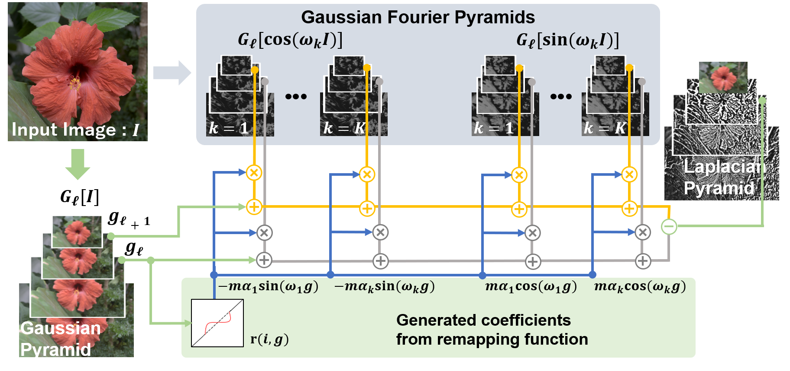

## Gaussian Fourier Pyramid for Local Laplacian Filter



The optimized code for the paper is published in the part of my library [OpenCP](https://github.com/norishigefukushima/OpenCP).
The detail part for this paper is [here](https://github.com/norishigefukushima/OpenCP/tree/master/MultiScaleFilter).

However, the code published on OpenCP is heavily optimized, i.e., less readable. 
Therefore this page also provides readable codes: C++ header only code and Python implementation based on OpenCV.
The header only code has about 500 lines, while the optimized code has 15000+ lines.

If you need faster operation, please use the code in the OpenCP project.

* [header only C++](https://github.com/norishigefukushima/GaussianFourierPyramid/blob/main/GaussianFourierPyramid/LLF.hpp)
    * The sln file (GaussianFourierPyramid.sln) is for the project of header only C++.
* Python
    * under construction.

## Usage (C++)
1. Generate an instance (`FastLLF llf` or `GaussianFourierLLF gfllf`)
2. Generate parameter maps if you need adaptive filtering
3. Call the filter method (`llf.filter`, `gfllf.filter`)

The sample code is as follows:

```cpp
    //load image
	Mat src = imread("flower.png");
	//destination image
	Mat destFastLLF, destFourierLLF, destFastLLFAaptive, destFourierLLFAaptive;
	
	//parameter setting
	const float sigma = 30.f;
	const float boost = 2.f;
	const int level = 2;
	const int order = 4;

	//create instance
	FastLLF llf;
	GaussianFourierLLF gfllf;

	//parameter fix filter
	llf.filter(src, destFastLLF, order * 2, sigma, boost, level);//order*2: FourierLLF requires double pyramids due to cos and sin pyramids; thus we double the order to adjust the number of pyramids.
	gfllf.filter(src, destFourierLLF, order, sigma, boost, level);
	
	//parameter adaptive filter
	//generate parameter maps (circle shape)
	Mat sigmaMap(src.size(), CV_32F);
	sigmaMap.setTo(sigma);
	circle(sigmaMap, Point(src.size()) / 2, src.cols / 4, Scalar::all(sigma * 2.f), cv::FILLED);

	Mat boostMap(src.size(), CV_32F);
	boostMap.setTo(boost);
	circle(boostMap, Point(src.size()) / 2, src.cols / 4, Scalar::all(boost * 2.0), cv::FILLED);

	//filter
	llf.filter(src, destFastLLFAaptive, order * 2, sigmaMap, boostMap, level);
	gfllf.filter(src, destFourierLLFAaptive, order, sigmaMap, boostMap, level);
```

## Information

Y. Sumiya, T. Otsuka, Y. Maeda, and N. Fukushima, "Gaussian Fourier Pyramid for Local Laplacian Filter," IEEE Signal Processing Letters (SPL), vol. 29, pp. 11-15, 2022.

* [IEEE Xplore](https://ieeexplore.ieee.org/document/9580704)

```
@article{sumiya2022spl,
    author  = {Y. Sumiya and T. Otsuka and Y. Maeda and N. Fukushima},
    title   = {Gaussian Fourier Pyramid for Local Laplacian Filter},
    journal = {IEEE Signal Processing Letters},
    volume  = {29},
    number  = {},
    pages   = {11-15},
    year    = {2022},
}
```
